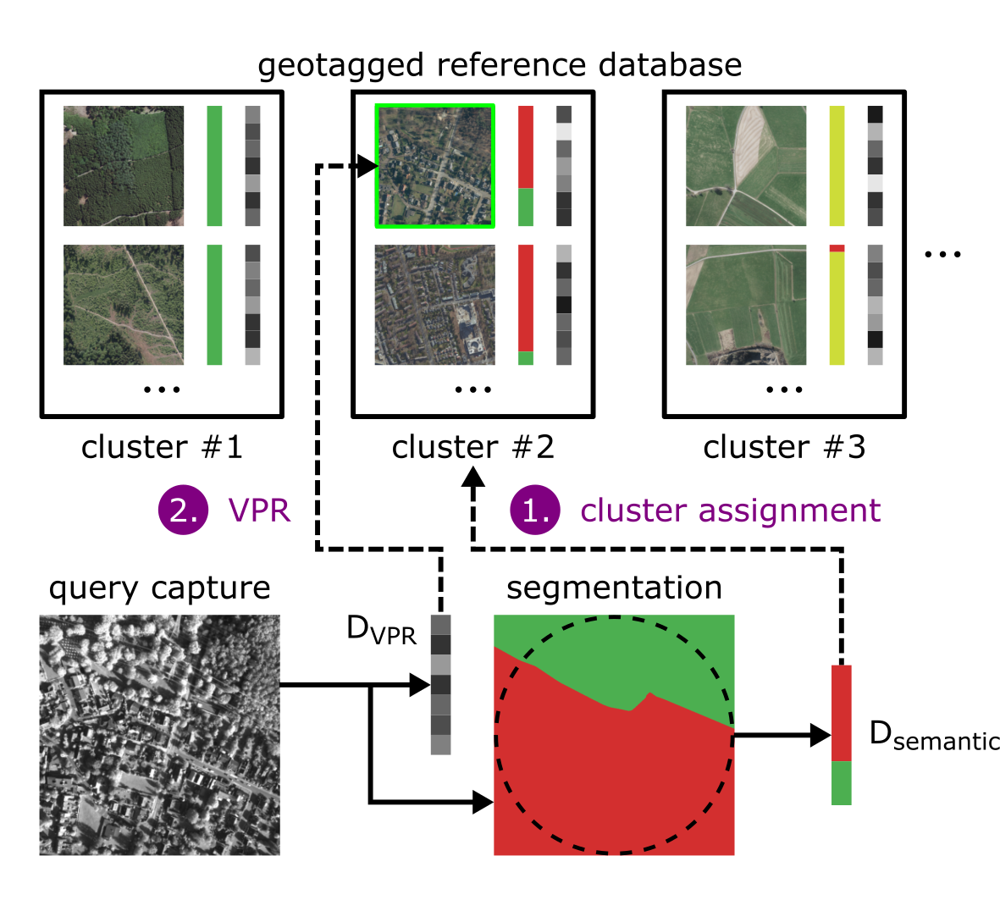

# Semantic Clustering for Visual Localization

This repository contains the code for IROS 2024 submission *Semantic Clustering of Image Retrieval Databases used for Visual Localization*. The code can be used to adapt the procedure to other datasets and to reproduce our results after publishing the entire 4Seasons dataset. The individual submodules that realize the individual components of our pipeline are collected here.

    

## Visual Place Recognition

In our experiments, we resort to [NetVlad](https://arxiv.org/abs/1511.07247) to learn VPR descriptors which form a image retrieval database. For implementation, we used [Nanne's repository](https://github.com/Nanne/pytorch-NetVlad), which we adapted to our dataset and managed in [pytorch-NetVlad](https://github.com/hlzmnhnry/pytorch-NetVlad).

## Semantic Clustering

For semantic clustering we used a script for learning (semantic) clusters based on the semantic distributions within the semantic segmentation masks. Based on the learned clusters, we (soft-)assign query captures to search spaces and match VPR descriptors within the reduced search space. Our scripts for this are managed in [sem-clustering](https://github.com/hlzmnhnry/sem-clustering).

## Semantic Segmentation

TODO: upload code for semantic segmentation.
